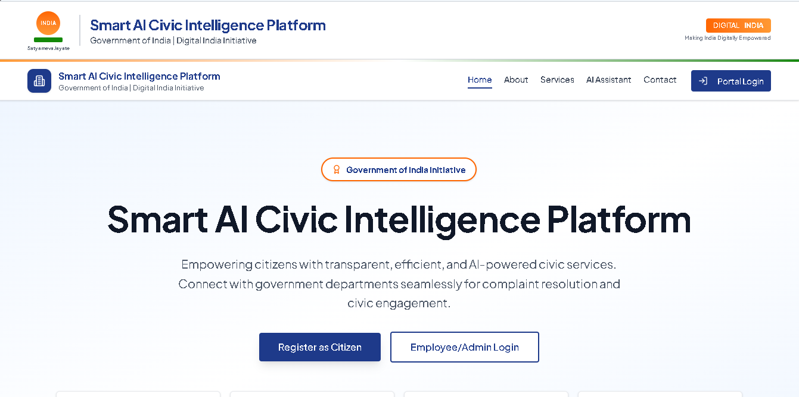
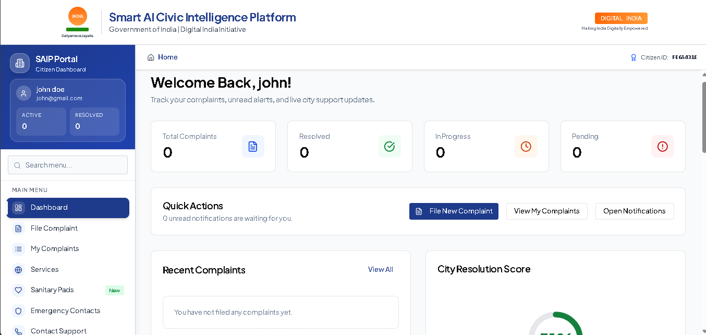
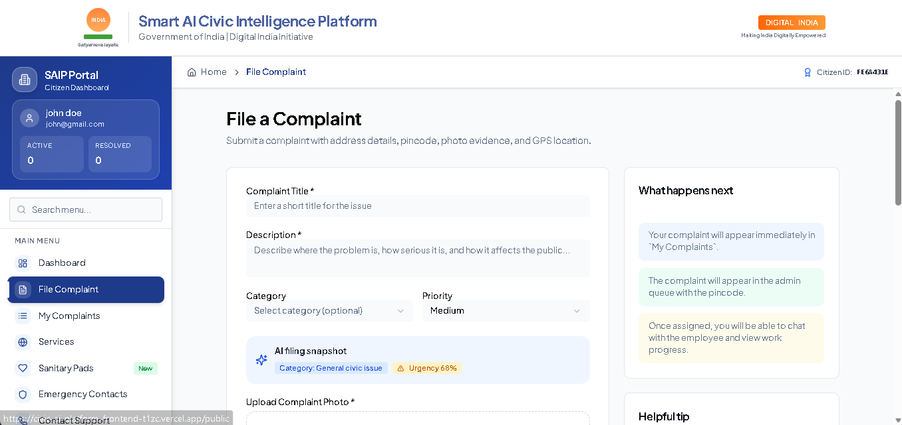
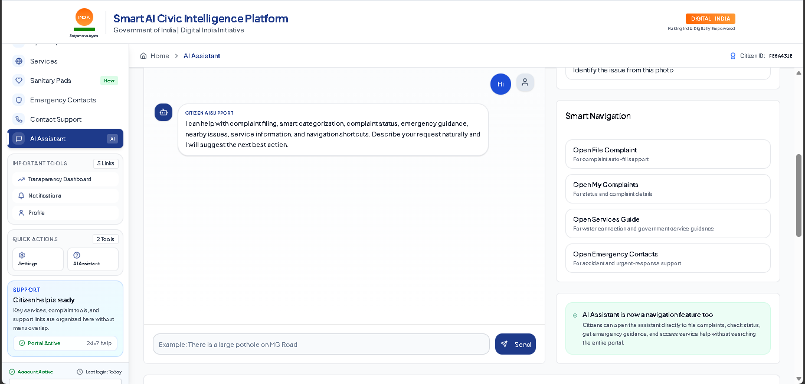

<!-- ===================== HERO ===================== -->

<p align="center">
  
</p>

<h1 align="center">🚀 Smart AI Civic Intelligence Platform (SAIP)</h1>

<p align="center">
  <strong>AI-powered governance system for transparent, efficient, and intelligent civic management</strong>
</p>

<p align="center">
  <a href="https://civic-ai-platform-frontend-t1zc.vercel.app/">
    
  </a>
  
  
  
</p>

---

## 🌍 Problem

Modern civic systems suffer from:

* ❌ Delayed complaint resolution
* ❌ Lack of transparency
* ❌ Poor citizen engagement
* ❌ No intelligent data usage

---

## 💡 Solution

SAIP is a **full-stack AI-powered civic platform** that transforms complaints into:

* 📊 Actionable insights
* ⚡ Faster resolution workflows
* 🔍 Transparent governance

---

## 🖥️ Live Demo

<p align="center">
  <a href="https://civic-ai-platform-frontend-t1zc.vercel.app/">
    
  </a>
</p>

👉 Click the image above to explore the live application

---

## 🖼️ Application Preview

### 📊 Dashboard Overview

<p align="center">
  
</p>

---

### 📝 Complaint Submission (AI Powered)

<p align="center">
  
</p>

---

### 🤖 AI Assistant

<p align="center">
  
</p>

---

## 🧠 Key Features

### 👤 Multi-Role System

* Citizen / Officer / Admin dashboards
* Secure JWT authentication
* Role-Based Access Control (RBAC)

---

### 📍 Smart Complaint System

* Location-based complaint submission
* Image + text input
* AI categorization & urgency detection
* Status tracking timeline

---

### 🤖 AI Intelligence Layer

* NLP-based classification
* Priority scoring
* Smart routing system

---

### 📊 Analytics Dashboard

* Complaint trends
* Department performance
* Resolution metrics

---

### 🚨 Fraud Detection

* Spam complaint filtering
* Pattern-based anomaly detection

---

## 🏗️ System Architecture

```text
Client (Web App)
   ↓
Frontend (React + TypeScript + Tailwind)
   ↓
Backend API (Node.js + Express)
   ↓
Core Services (Auth, Complaint, Analytics)
   ↓
AI Microservice (Python + FastAPI)
   ↓
PostgreSQL + Redis
   ↓
Queue + Notifications
```

---

## 🔄 Data Flow

1. User submits complaint
2. Backend stores request
3. AI service processes:

   * Category
   * Priority
4. Complaint assigned automatically
5. Dashboard updates

---

## 📁 Project Structure

```bash
apps/
  ├── ai-service/
  ├── api/
  ├── frontend/
docs/
  └── images/
docker-compose.yml
turbo.json
```

---

## 🛠️ Tech Stack

### 🎨 Frontend

* React with TypeScript
* Tailwind CSS
* Component-driven architecture
* Responsive dashboard UI

### ⚙️ Backend

* Node.js
* Express.js
* JWT Authentication
* RBAC (Role-Based Access Control)

### 🧠 AI Layer

* Python
* FastAPI
* NLP-based classification

### 🗄️ Database

* PostgreSQL
* Redis (caching & queue)

### 🐳 DevOps

* Docker
* Vercel (frontend deployment)

---

## ⚙️ Engineering Highlights

* Microservices architecture
* AI-integrated backend pipeline
* Type-safe frontend using TypeScript
* Real-time capable system design
* Scalable modular architecture

---

## 🌟 Why This Project Stands Out

* 🏛 Government-level system design
* 🧠 AI + Backend integration
* 📊 Real-world problem solving
* ⚙️ Production-ready architecture

---

## 🚀 Future Scope

* IoT integration (traffic, pollution sensors)
* Multi-city deployment
* Blockchain-based transparency

---

## 🤝 Contribution

Open for collaboration on:

* Backend systems
* AI integrations
* System design

---

<p align="center">
  <strong>✨ Building systems that create real-world impact ✨</strong>
</p>
